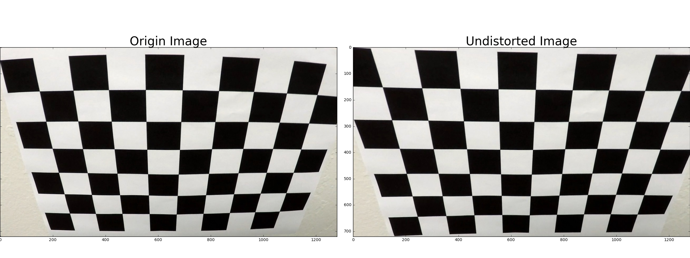

## Writeup of advance lane detection

---

### The project structure:
* P4_1.ipynb: A step by step processing
* P4_2.ipynb: Detect the line in test video
* Folder output_videos: Store the output video of this project
**Advanced Lane Finding Project**

The steps of this project are the following:

* Compute the camera calibration matrix and distortion coefficients given a set of chessboard images.
* Apply a distortion correction to raw images.
* Use color transforms, gradients, etc., to create a thresholded binary image.
* Apply a perspective transform to rectify binary image ("birds-eye view").
* Detect lane pixels and fit to find the lane boundary.
* Determine the curvature of the lane and vehicle position with respect to center.
* Warp the detected lane boundaries back onto the original image.
* Output visual display of the lane boundaries and numerical estimation of lane curvature and vehicle position.

## [Rubric](https://review.udacity.com/#!/rubrics/571/view) Points

### Here I will consider the rubric points individually and describe how I addressed each point in my implementation.

---

### Writeup file

#### 1. Provide a Writeup file that includes all the rubric points and how you addressed each one. 

### Camera Calibration

#### 1.Computed the camera matrix and distortion coefficients. 
I start by preparing "object points", which will be the (x, y, z) coordinates of the chessboard corners in the world. 
Here I am assuming the chessboard is fixed on the (x, y) plane at z=0, such that the object points are the same for 
each calibration image.  Thus, `objp` is just a replicated array of coordinates, and `objpoints` will be appended 
with a copy of it every time I successfully detect all chessboard corners in a test image.  `imgpoints` will be 
appended with the (x, y) pixel position of each of the corners in the image plane with each successful chessboard 
detection. The corners in the chessboard is like:


I then used the output `objpoints` and `imgpoints` to compute the camera calibration and distortion coefficients using 
the `cv2.calibrateCamera()` function.  I applied this distortion correction to the test image using the 
`cv2.undistort()` function and obtained this result:


### Pipeline (single image)

#### 1. Read in an image and undistroted it

To demonstrate this step, I will describe how I apply the distortion correction to one of the test images like this one:


#### 2. Use color transforms, gradients  to create a thresholded binary image.  

***define the color and gradient filter functions***

I used a combination of `sobel_x_filter` and `L_threshold` to generate a binary image. Here's an example of my output for this step


```python

```

#### 3. Describe how to  performe a perspective transform 

The code for perspective transform includes two parts(or two functions):one is called `get_M()`, the other is called
`warp()`, the first function is used for getting the perspective transform matrixs "M", the second function is used for
making an perspective transform using the "M".
Below is the two functions:

In video processing, a class called `ImageInfo` is defined to store the warp information 
(I think the PerspectiveTransform imformation is static, there is no need to compute the M and M_inverse every frame). 
The detail of the class is:
```python
# Construct a function to make perspective transform so that hte lines look
# straight from a bird's eye view, it returns perspective transform matrixs
def get_M(img):
    img_size = (img.shape[1], img.shape[0])
    # Four source coordinates
    src = np.float32([[733, 477], [1110, 719], [226, 719],[559, 477]])
    # Four desired coordinates
    dst = np.float32([[1010, 350], [1010, 719], [336, 719],[336, 350]])
    
    # Compute the perspective transform matrix M
    M = cv2.getPerspectiveTransform(src, dst)
    # Compute the inverse erspective transform matrix Minv
    Minv = cv2.getPerspectiveTransform(dst, src)
    
    return M, Minv


# Define a function using perspective transform matrix and output warped image
def warp(img, M):
    img_size = (img.shape[1], img.shape[0])
    warped_image = cv2.warpPerspective(img, M, img_size, flags=cv2.INTER_LINEAR)
    
    return warped_image

```
The warp result of a straight line and test line are:

The warp result of a binary image line and test line are:


#### 4. Describe how to identify lane-line pixels and fit their positions with a polynomial

```python
# Define function to find the lane boundary
def line_fit(binary_warped, nwindows=9, margin=100, minpix=50):
    histogram = np.sum(binary_warped[binary_warped.shape[0]//2:,:], axis=0)
    # Create an output image to draw on and  visualize the result
    img_with_window = np.dstack((binary_warped, binary_warped, binary_warped))*255
    img_without_window = np.copy(img_with_window)
    # Find the peak of the left and right halves of the histogram
    # These will be the starting point for the left and right lines
    midpoint = np.int(histogram.shape[0]/2)
    leftx_base = np.argmax(histogram[:midpoint])
    rightx_base = np.argmax(histogram[midpoint:]) + midpoint

    # Choose the number of sliding windows
    nwindows = nwindows
    # Set height of windows
    window_height = np.int(binary_warped.shape[0]/nwindows)
    # Identify the x and y positions of all nonzero pixels in the image
    nonzero = binary_warped.nonzero()
    nonzeroy = np.array(nonzero[0])
    nonzerox = np.array(nonzero[1])
    # Current positions to be updated for each window
    leftx_current = leftx_base
    rightx_current = rightx_base
    # Set the width of the windows +/- margin
    margin = margin
    # Set minimum number of pixels found to recenter window
    minpix = minpix
    # Create empty lists to receive left and right lane pixel indices
    left_lane_inds = []
    right_lane_inds = []

    # Step through the windows one by one
    for window in range(nwindows):
        # Identify window boundaries in x and y (and right and left)
        win_y_low = binary_warped.shape[0] - (window+1)*window_height
        win_y_high = binary_warped.shape[0] - window*window_height
        win_xleft_low = leftx_current - margin
        win_xleft_high = leftx_current + margin
        win_xright_low = rightx_current - margin
        win_xright_high = rightx_current + margin
        # Draw the windows on the visualization image
        cv2.rectangle(img_with_window,(win_xleft_low,win_y_low),(win_xleft_high,win_y_high),
        (0,255,0), 2) 
        cv2.rectangle(img_with_window,(win_xright_low,win_y_low),(win_xright_high,win_y_high),
        (0,255,0), 2) 
        # Identify the nonzero pixels in x and y within the window
        good_left_inds = ((nonzeroy >= win_y_low) & (nonzeroy < win_y_high) & 
        (nonzerox >= win_xleft_low) &  (nonzerox < win_xleft_high)).nonzero()[0]
        good_right_inds = ((nonzeroy >= win_y_low) & (nonzeroy < win_y_high) & 
        (nonzerox >= win_xright_low) &  (nonzerox < win_xright_high)).nonzero()[0]
        # Append these indices to the lists
        left_lane_inds.append(good_left_inds)
        right_lane_inds.append(good_right_inds)
        # If you found > minpix pixels, recenter next window on their mean position
        if len(good_left_inds) > minpix:
            leftx_current = np.int(np.mean(nonzerox[good_left_inds]))
        if len(good_right_inds) > minpix:        
            rightx_current = np.int(np.mean(nonzerox[good_right_inds]))

    # Concatenate the arrays of indices
    left_lane_inds = np.concatenate(left_lane_inds)
    right_lane_inds = np.concatenate(right_lane_inds)

    # Extract left and right line pixel positions
    leftx = nonzerox[left_lane_inds]
    lefty = nonzeroy[left_lane_inds] 
    rightx = nonzerox[right_lane_inds]
    righty = nonzeroy[right_lane_inds] 

    img_with_window[nonzeroy[left_lane_inds], nonzerox[left_lane_inds]] = [255, 0, 0]
    img_with_window[nonzeroy[right_lane_inds], nonzerox[right_lane_inds]] = [0, 0, 255]
    
    img_without_window[nonzeroy[left_lane_inds], nonzerox[left_lane_inds]] = [255, 0, 0]
    img_without_window[nonzeroy[right_lane_inds], nonzerox[right_lane_inds]] = [0, 0, 255]

    return img_with_window, img_without_window, leftx, lefty, rightx, righty
 

```
The result of a this function is:


#### 5. Calculate the radius of curvature of the lane and the position of the vehicle with respect to center.

```python
# Define function to calculate the curvature of the lane and vehicle position with respect to center
def cal_radius_and_caroff(binary_img_size, leftx, lefty, rightx, righty, xm_per_pix, ym_per_pix):
   
    # Fit a second order polynomial to pixel positions in each lane line
    left_fit = np.polyfit(lefty, leftx, 2)
    right_fit = np.polyfit(righty, rightx, 2)
    
    # Define y-value where we can get the x coordinate of the bottom of lane lines
    y_eval_position = binary_img_size[0] - 1
    
    base_left = left_fit[0]*y_eval_position**2 + left_fit[1]*y_eval_position + left_fit[2]
    base_right = right_fit[0]*y_eval_position**2 + right_fit[1]*y_eval_position + right_fit[2]
    car_position = binary_img_size[1] // 2
    lane_center = base_left + (base_right - base_left)/2
    car_offset = (car_position - lane_center)*xm_per_pix
    
    # Define y-value where we want radius of curvature
    # I'll choose the maximum y-value, corresponding to the bottom of the image
    y_eval_radius = (binary_img_size[0]-1)*ym_per_pix
    # Fit new polynomials to x,y in world space
    left_fit_cr = np.polyfit(lefty*ym_per_pix, leftx*xm_per_pix, 2)
    right_fit_cr = np.polyfit(righty*ym_per_pix, rightx*xm_per_pix, 2)
    # Calculate the new radius of curvature
    left_curverad = ((1 + (2*left_fit_cr[0]*y_eval_radius + left_fit_cr[1])**2)**1.5) / np.absolute(2*left_fit_cr[0])
    right_curverad = ((1 + (2*right_fit_cr[0]*y_eval_radius + right_fit_cr[1])**2)**1.5) / np.absolute(2*right_fit_cr[0])

    return car_offset, left_curverad, right_curverad
```


#### 6. Provide an example image of your result plotted back down onto the road.

First I project back the fitted line to the original sight. Then the radius of curvature and offset of the car has been drawed in the image.


### Pipeline (video)

#### 1. Provide a link to your final video output.  Your pipeline should perform reasonably well on the entire project video (wobbly lines are ok but no catastrophic failures that would cause the car to drive off the road!).

The output vidio is in the 'output_videos/project_vidio_output.mp4'


### Discussion

#### 1. Briefly discuss any problems / issues you faced in your implementation of this project.  Where will your pipeline likely fail?  What could you do to make it more robust?
It is hard to choose color spaces, gradient threshold and  color threshold to generalize the algorithm. Can you give me some idea about how to get the algorithm robust.


```python

```
